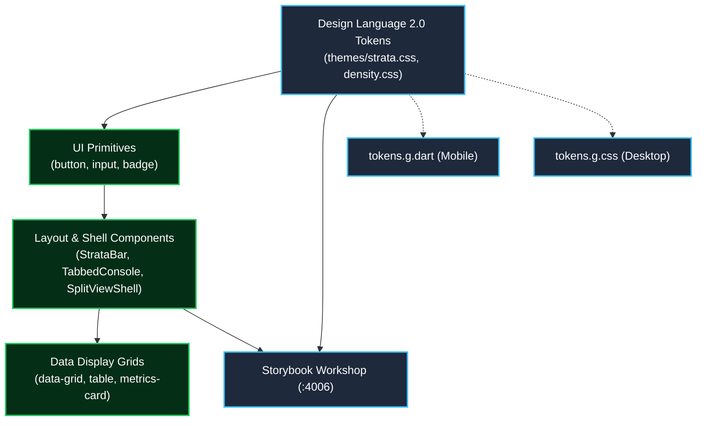

# Architecture Specification: UniERP Strata Workbench Design System (`design-system`)

- **Layer**: Layer L1 (Foundation)
- **Package Identity**: `@kannan19302/ui`
- **Owning ADR**: [ADR-0010: UniERP Master Platform Goal and Polyrepo Architecture Boundaries](../unierp-platform/docs/adr/ADR-0010-platform-north-star-and-polyrepo-boundaries.md)
- **Status**: Authoritative & Production-Active

---

## 1. Executive Summary & Purpose

Authoritative enterprise UI library, Strata Workbench design tokens, 4-tier density scale, and 5-file uniform component anatomy.

This repository is one delivery unit in the UniERP 31-repository polyrepo estate, anchored by the **UniERP Master Platform North Star Goal**:
> "Build the world's premier autonomous, multi-tenant Enterprise SaaS Operating System: delivering 100% Zero-Trust Multi-Tenant Isolation with PostgreSQL Row-Level Security on every tenant table, Absolute Decimal(19,4) Numeric Precision across all ledgers, Atomic Durable Audit Logging, Sub-100ms P99 Transaction Latency, and a Unified High-Density Strata Workbench Design Language across all 1,198 web routes, native mobile, and desktop clients."

---

## 2. System Context & Architectural Boundaries

### Boundary Contract
- **Allowed Inbound Consumers**: L4 (Presentation), L5 (Clients), L1 (Storybook)
- **Allowed Outbound Dependencies**: @kannan19302/contracts (L0)
- **Strictly Forbidden Dependencies**:
  - ❌ Layers L2-L7
  - ❌ Database ORM
  - ❌ Server actions
  - ❌ Backend fetch orchestration

---

## 3. Technology Stack & Key Primitives

- **Core Runtime & Languages**: React 18/19, CSS Modules, Vitest, vitest-axe, TypeScript
- **Primary Interface**: `@kannan19302/ui`
- **Verification Harness**: `pnpm test && pnpm build`

---

## 4. Quality Engineering & Verification Gates

To maintain institutional reliability, this repository is governed by the 10 Pillars of Enterprise Design System Excellence ([`docs/DESIGN_SYSTEM_STANDARDS.md`](docs/DESIGN_SYSTEM_STANDARDS.md)):
1. **Type Safety Gate**: Zero TypeScript/type-checker errors under strict mode (`pnpm typecheck`).
2. **Token Purity Gate**: 100% token purity with zero raw hex or px (`node scripts/check-tokens.mjs`).
3. **Contrast & a11y Gate**: WCAG 2.2 AA compliance across all 6 themes (`node scripts/check-contrast.mjs`).
4. **Density Matrix Gate**: Strict 4-tier density compliance (`node scripts/check-density.mjs`).
5. **Storybook Gate**: 100% clean AST compilation and taxonomy (`node scripts/check-storybook-standards.mjs`).
6. **Logical Properties Gate**: Zero physical directional CSS (`node scripts/check-logical-properties.mjs`).
7. **Layer Boundary Gate**: Verified by `scripts/check-layer.mjs` to prevent upward coupling.
8. **Automated Test Suite**: Must execute cleanly with 100% pass rate (`pnpm test`).

---

## 5. Associated AI Skills & Governance Links

- **Platform Standard**: [`platform/workspace/.agents/standards/STRATA_DESIGN_SYSTEM_STANDARDS.md`](../platform/workspace/.agents/standards/STRATA_DESIGN_SYSTEM_STANDARDS.md)
- **Design System Standards**: [`docs/DESIGN_SYSTEM_STANDARDS.md`](docs/DESIGN_SYSTEM_STANDARDS.md)
- **Storybook Standards**: [`docs/STORYBOOK_STANDARDS.md`](docs/STORYBOOK_STANDARDS.md)
- **Workspace Governance**: [`../platform/workspace/governance/UNIERP_MASTER_PLATFORM_GOAL.md`](../platform/workspace/governance/UNIERP_MASTER_PLATFORM_GOAL.md)
- **Canonical Protocol**: [`../platform/docs/standards/AI_AGENT_DEVELOPMENT_PROTOCOL.md`](../platform/docs/standards/AI_AGENT_DEVELOPMENT_PROTOCOL.md)

