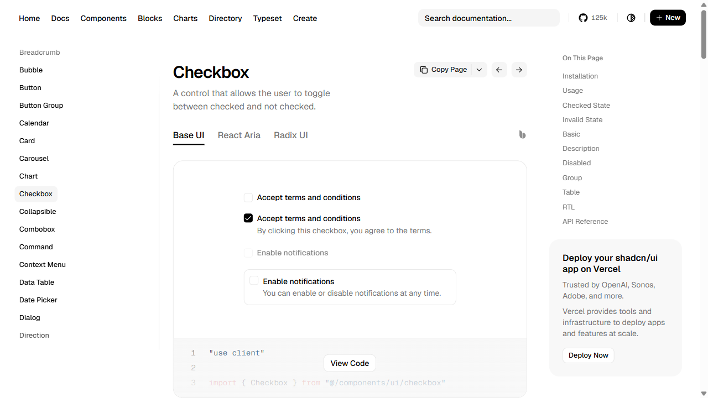
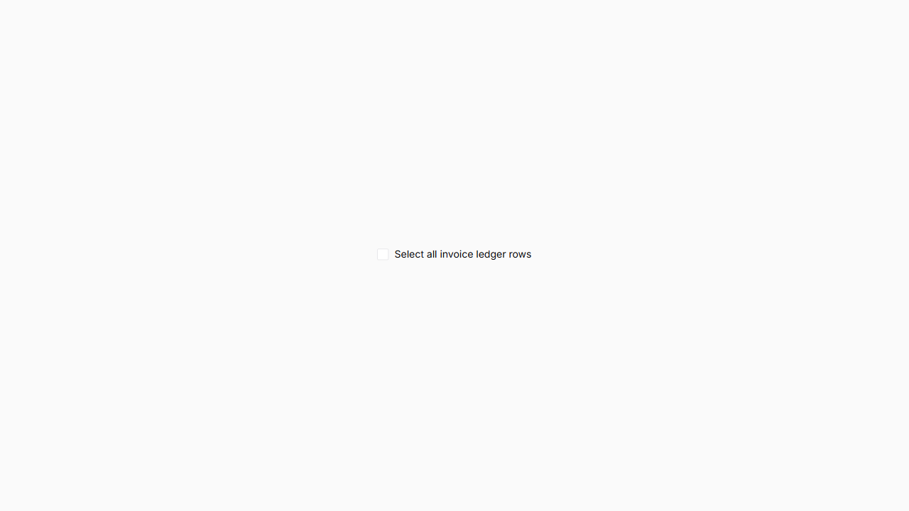

# Checkbox live comparison — 2026-09-28

Status: `PARTIAL`; ledger overall remains `NOT VERIFIED`. Risk: R2 shared-component correction with cross-root evidence. Owner: PLT-DS. Storybook is the direct preview consumer; Business Suite adoption and journey proof remain open. Contract: [mixed-state correction contract](../../../../../../platform/docs/platforms/design-system/STRATA_CHECKBOX_MIXED_STATE_CHANGE_CONTRACT_2026-09-28.md).

## Acceptance criteria

1. Compare Strata Default against the current official shadcn Base UI Checkbox at a matched 1280×720 CSS viewport; retain both captures.
2. Inspect at least three actual implementations where available and record which traits are relevant to the native Strata control.
3. Verify label, native state, keyboard focus and indeterminate semantics from the live local DOM/accessibility tree.
4. Inventory Business Suite source use and record the limits of that evidence.

AC1–AC4 are complete as evidence collection. The mixed-state implementation is now corrected and the browser snapshot reports `checked=mixed` before and after keyboard activation. The quality gate remains open for the broader theme/density/responsive/accessibility/package/consumer checks.

## Direct side-by-side capture

Both pages were captured at a 1280×720 CSS viewport on 2026-09-28. The local capture is Storybook `inputs-checkbox--default`; the primary reference is the official shadcn Base UI Checkbox page.

| Official shadcn Base UI | Strata Storybook Default |
| --- | --- |
|  |  |

Additional captures: [Strata indeterminate](strata-checkbox-indeterminate.png), [Strata after Tab + Space](strata-checkbox-indeterminate-after-space.png), [shadcn React Aria](reference-shadcn-checkbox-react-aria.png), and [shadcn Radix](reference-shadcn-checkbox-radix.png). The reference documentation shell and Storybook frame are not content-aligned; comparison uses the component’s measured control/label geometry and semantics, not surrounding page chrome.

## Reference selection and score

Scoring uses the frozen protocol’s 0–3 rubric; task fit and semantics/keyboard are doubled, giving 30 maximum points. Scores are provisional research judgments, not certification.

| Implementation | Task ×2 | Interaction | States | Responsive | Semantics ×2 | Visual | Portability | Maintenance | Total | Decision |
| --- | ---: | ---: | ---: | ---: | ---: | ---: | ---: | ---: | ---: | --- |
| [shadcn Base UI](https://ui.shadcn.com/docs/components/base/checkbox) | 3 | 2 | 3 | 2 | 3 | 3 | 3 | 3 | 28/30 | Primary; closest native-control comparison and docs show checked, invalid, label/description, disabled, group, table and RTL examples. |
| [shadcn React Aria](https://ui.shadcn.com/docs/components/aria/checkbox) | 3 | 2 | 3 | 2 | 3 | 2 | 2 | 3 | 26/30 | Supplemental; same user job and richer accessibility-focused variant; visible 13px control in the docs sample. |
| [shadcn Radix](https://ui.shadcn.com/docs/components/radix/checkbox) | 3 | 2 | 3 | 2 | 3 | 3 | 2 | 3 | 27/30 | Supplemental; actual Radix-based variant. Live DOM uses a 16×16 `button[role=checkbox]` with `aria-checked` false/true and `aria-invalid` on its invalid sample. |

Base UI is the selected primary because the page directly describes the ordinary checked/unchecked task and exposes several relevant composition/state examples without requiring the app to adopt its package. React Aria and Radix were inspected as shadcn-hosted implementation variants. Strata retains its native `<input>` implementation and four density tiers; no source, package, style system, or reference code was copied.

## Measured local evidence

| Axis | Official reference | Strata | Result |
| --- | --- | --- | --- |
| Default control geometry | Base UI live page: 16×16 CSS px | Visual indicator: 16×16 CSS px; native input: 0×0, opacity 0 | Box size matches; hidden input receives focus. |
| Label layout | Basic example, checkbox and label adjacent | 8px gap, native `<label>` association | Same basic anatomy. Local text is 13px Inter; the reference page uses its own docs typography. |
| Default accessibility | Base UI page identifies a checkbox and text label | AX: named native checkbox “Select all invoice ledger rows” | Name/role surfaced in browser accessibility snapshot. |
| Focus | Reference implementation offers keyboard checkbox control | Tab focuses the native input; visible indicator receives a 2px blue box shadow | Focus is visible in this sampled state; keyboard exit and other themes not tested. |
| Indeterminate | Reference ecosystem provides checkbox state implementations; Radix sample exposes `aria-checked` as explicit values | After the correction, the native input property is `indeterminate=true`; browser AX reports `[checked=mixed]`. After Tab + Space, input `checked=true`, `indeterminate=true`, visual `data-state=indeterminate`, AX remains mixed. | **Pass for the sampled native/browser state:** the existing prop now drives native mixed semantics and activation no longer leaves visual/native state divergent. Screen-reader output remains unverified. |
| Invalid / disabled | Reference docs include invalid and disabled examples | Local source sets `aria-invalid`; disabled applies opacity 0.55 to the whole control | Presence is source-backed; contrast and rendered state equivalence remain unverified. |
| Component-specific variations | Reference pages also show description, group, table and RTL use | Strata stories include invalid, disabled, description, selection workbench, and four densities | Coverage exists in stories, but not a complete browser/theme/keyboard matrix. |

The default capture pair uses matched browser viewport dimensions, but the components occur in different surrounding page layouts. This is not a pixel-aligned component crop. The DOM geometry is the exact basis for the 16px control-size comparison.

## Strata findings and outstanding proof

- The original evidence-only comparison found the indeterminate mismatch. The R2 correction now synchronizes `HTMLInputElement.indeterminate` from the existing prop, restores it after native activation, and preserves the forwarded input ref. A regression test covers prop updates and activation. No redundant `aria-checked` is added; the live browser accessibility snapshot reports the native checkbox as mixed.
- The native input is 0×0 and transparent. The visible focus box does style the adjacent indicator on Tab in this browser sample.
- Source CSS dims the whole disabled control to 55% opacity and includes a literal red fallback for invalid state. Contrast/token compliance across themes is unverified.
- Business Suite source inventory found six native `type="checkbox"` callsites and no shared Strata `Checkbox` import/JSX callsite. This establishes neither route rendering nor an end-to-end customer journey.
- Source review shows `V1WorkspacePreview` exercises parent-owned batch selection, but its real Business Suite integration is not established.
- No all-density geometry capture, three-theme comparison, narrow reflow/200% zoom, RTL interaction, forced-colors, reduced-motion, live screen-reader sample, published package validation, Business Suite build, or route journey was run for this packet. The focused component test (including its axe assertions), typecheck, Storybook standards and production Storybook build have since passed; full package test/lint/build results are tracked in the iteration report.

## Evidence binding and status

- Repository: `design-system`; base HEAD: `8b9354b1cb05f7b4413fb10c72fad605d3038eb6`; source blob `src/inputs/checkbox/checkbox.tsx`: `64452fa732e8d07e583eb4cd6d24a7677d00d182`; test blob: `6d60c17d1213d5430a64e257654b56386c6a016a`. Storybook was rebuilt from this working tree (which also contains unrelated user changes).
- Local Default: `http://127.0.0.1:6006/iframe.html?id=inputs-checkbox--default&viewMode=story`.
- Local mixed state: `http://127.0.0.1:6006/iframe.html?id=inputs-checkbox--indeterminate&viewMode=story`.
- Primary: `https://ui.shadcn.com/docs/components/base/checkbox`; supplements: `https://ui.shadcn.com/docs/components/aria/checkbox`, `https://ui.shadcn.com/docs/components/radix/checkbox`.
- Viewport: 1280×720 CSS px; date: 2026-09-28. Screenshots are in this directory.

Designed: benchmark and focused R2 contract. Implemented: native indeterminate synchronization and regression test. Tested: focused test, typecheck, Storybook standards/build and live browser DOM/AX plus Tab + Space sample; broader consumer and accessibility matrix remain open. Integrated: Storybook preview only; Business Suite integration not proven. Deployed: no. Released/published: no.

Knowledge delta: `UPDATED`. Overall Checkbox remains `NOT VERIFIED` pending full matrices and consumer proof; the confirmed mixed-state defect is corrected in the current working tree.
