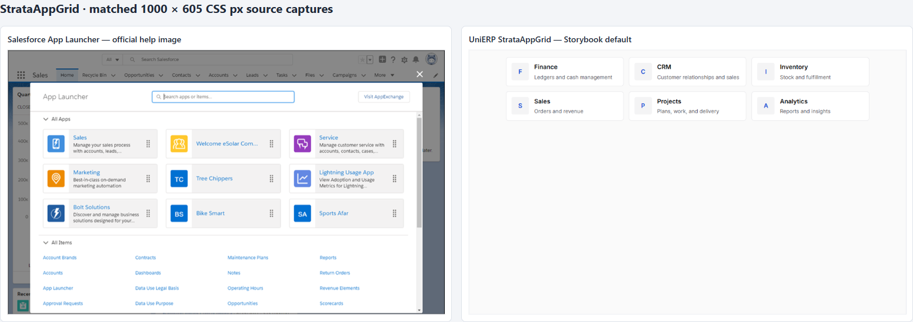

# StrataAppGrid live comparison — 2026-09-28

Status: `PARTIAL`. Overall component status remains `NOT VERIFIED` until its full quality matrix and Business Suite route behavior pass.

## Reference and matched capture

- Primary reference: [Salesforce App Switching in Lightning Experience](https://help.salesforce.com/s/articleView?id=sf.basics_app_launcher_lex.htm&language=en_US&type=5), using the official [App Launcher screenshot](https://sf-zdocs-cdn-prod.zoominsoftware.com/tdta-xcloud-basics-264-0-0-production-enus/371149a4-635d-4619-8372-4a7dc14310da/basics/images/app_launcher_lex.png).
- Observed reference pattern: three-column app tiles with icon/name/description and reorder handles; header search; separate All Items list. App visibility is permission-controlled by the consumer.
- Storybook: `navigation-strataappgrid--default`, rendered with six Business Suite-style sample app links.
- Reference screenshot and Storybook screenshot were captured at 1000×605 CSS pixels. The saved [side-by-side comparison](comparison-side-by-side.png) scales both captures equally for direct visual inspection.

Individual captures: [online reference](reference-salesforce-1000x605.png), [Storybook default](storybook-default-1000x605.png), and [Storybook keyboard focus](storybook-keyboard-focus-1000x605.png).

## Findings and changes

The first local render used Storybook's global centered layout, which shrink-wrapped this width-sensitive grid to one column. The story now uses a padded canvas so its browser evidence represents an application content region. The grid has a 52rem maximum inline size; the six-item Storybook default produces three columns and two rows at 1000×605. Measured tile size is approximately 269×66.6 px, compared with about 262×67 px in the Salesforce image; the 7 px tile-width difference is acceptable for this distinct Strata app-catalog surface. Tile height and 12 px gutter are closely aligned.

Tab reaches the first application link. Its focus outline is visible; computed browser style reports an outline width of 1.6 CSS px (the authored rule is 2 px). The component exposes a navigation landmark, list, and named links; its focused unit suite passes the default and empty cases (2/2). The production Storybook static story also loaded, and its accessibility snapshot exposed the navigation landmark and six named application links.

The reference has a search field, app-specific icon marks, reorder affordances, and a separate All Items region. Business Suite owns app authorization, catalog filtering, ordering, and item links; these functions must remain in the consumer or a separately scoped generic interaction contract. This comparison does not claim those flows are present in StrataAppGrid. The current Business Suite catalog page already provides consumer-owned filtering.

## Remaining verification

- Compare 320 px and 200% zoom, plus all themes, applicable density modes, and LTR/RTL.
- Run browser accessibility checks and a screen-reader review.
- Exercise the actual Business Suite home/catalog routes with approved tenant data and prove unauthorized apps never enter the supplied `apps` list.
- Capture hover, empty, and high-contrast states; the overall row remains `NOT VERIFIED` until these and consumer criteria pass.

Node 22.23.3 provider proof for this iteration: focused tests 2/2, `check:storybook` passed (123 story files / 116 component stories), package `build` passed, `lint` passed, production Storybook build passed, and `check:tokens` reported no new violations (155 remain baselined).

Designed: grid presentation and consumer-owned data boundary. Implemented: padded story canvas, six-item example, and 52rem maximum width. Tested: focused tests and provider gates pass; browser Tab focus and matched screenshots observed. Integrated: existing Business Suite home/catalog use remains unverified as a route journey. Deployed: no. Released: no. Knowledge delta: `UPDATED`; full component evidence is `REQUIRED-BUT-INCOMPLETE`. **This is not done.**
