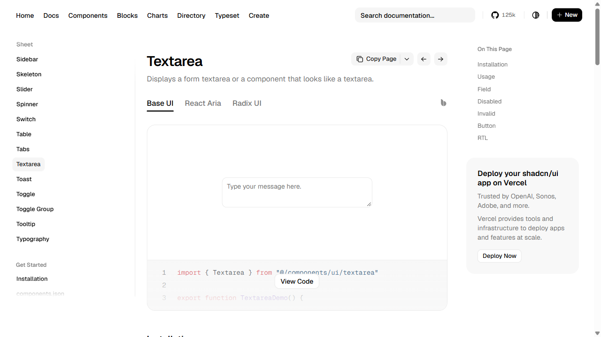
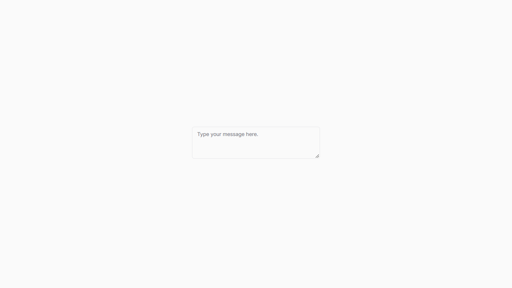

# Textarea live comparison — 2026-09-28

Status: `PARTIAL`; ledger overall remains `NOT VERIFIED`. Risk: R1 Storybook fixture correction. Owner: PLT-DS. Direct consumer: Storybook. Business Suite contains direct `Textarea` use in checkout and CRM/HR routes, but no route/journey was rendered in this packet.

## Side-by-side evidence

Both pages were inspected at a 1280×720 CSS-pixel browser viewport. Local Storybook was rebuilt from the current source before the after capture. The online page uses the official shadcn Base UI Textarea example.

| shadcn Base UI reference | Strata Storybook Default after fixture correction |
| --- | --- |
|  |  |

Pre-correction local capture: [Strata before](strata-textarea-before.png). Focus sample: [Storybook textbox focused by Tab](strata-textarea-focus.png). Narrow sample: [Storybook at 320px viewport](strata-textarea-320px.png).

## Measured comparison

| Axis | shadcn Base UI | Strata current story | Result |
| --- | --- | --- | --- |
| Default state | Empty, placeholder `Type your message here.` | Same placeholder; accessible name `Message` | Task wording aligned; Strata now has an explicit accessible name. |
| Box at 1280×720 | 320×64px | 320×80px | Width now matches; Strata remains 16px taller due to its standard-density minimum. |
| Box before fixture correction | — | 185×80px | Story had no field width context and inherited three rows. |
| Typography | Geist 14px / 20px line-height | Inter 13px / 19.5px line-height | Intentional Strata language difference. |
| Shape and inset | 10px radius; 8px 10px padding | 6px radius; 8px 12px padding | Intentional Strata tokens; not copied. |
| Resize | Vertical | Vertical | Equivalent affordance. |
| Narrow 320px viewport | Online page is shell-constrained; exact reference field width is not a component requirement | 288×80px at x=16px; document/body each 320px | Local fixture reflows without horizontal page overflow. |
| Keyboard/accessibility | Online AX recognizes native multiline textbox from its placeholder | AX names it `Message`; Tab focuses it and the visible focus treatment appears | Focus/name sample passes; screen-reader behavior remains unverified. |

The official page was also inspected in its [React Aria](https://ui.shadcn.com/docs/components/aria/textarea) and [Radix](https://ui.shadcn.com/docs/components/radix/textarea) implementations. They retain native multiline text entry and show labeled/described, disabled, invalid, button-composed, and RTL examples. Base UI is primary because its Basic example is the closest direct empty-control equivalent; the other variants confirm semantics and state patterns. No source or dependency was copied.

## Strata-specific findings and remaining work

- The Default story fixture now uses a 320px max width, a two-row empty value, and an accessible name. At a 320px viewport it retains 16px side gutters and no document overflow.
- Runtime `Textarea` CSS still produces 80px minimum height for this two-row standard-density story, against the 64px reference. The 32px Strata standard control scale and current `2.5 ×` rule have not been reconciled with the direct reference. That is a real visual difference and remains a provider calibration decision; the fixture does not hide it.
- Source review found disabled text combines a muted color with 50% opacity, and the error styles include a literal `#ef4444` fallback. Their contrast/token behavior has not been verified across themes. No runtime fix was made while the Input/DataTable/Breadcrumb calibration gate remains open.
- No full state/theme/density/direction/RTL matrix, browser contrast calculation, 200% browser zoom, forced-colors, reduced-motion, screen-reader, published-package, or Business Suite route proof is claimed.

## Checks

Node `v22.23.3`:

| Check | Result |
| --- | --- |
| `pnpm exec vitest run src/inputs/text-area/text-area.test.tsx` | PASS — 4/4 tests, including existing axe test. |
| `pnpm typecheck` | PASS. |
| `pnpm check:storybook` | PASS — 120 source story files parsed; 113 component story standards pass. |
| `pnpm check:tokens` | PASS — no new violations; 155 existing violations remain baselined across 19 files. |
| `pnpm --dir storybook build-storybook` | PASS — fresh static build, 2,316 modules transformed. |
| Browser default geometry | PARTIAL — width matched at 320px; local height is 80px vs reference 64px. |
| 320px reflow | PASS — 288px field, 16px margins, document/body remain 320px. |
| Name and focus | PARTIAL — native multiline textbox is named and receives visible Tab focus; screen reader unverified. |

Designed: direct reference comparison and Storybook frame. Implemented: story-only example change. Tested: focused test, typecheck, standards, build, measured desktop/narrow browser states. Integrated: Storybook only; not integrated with Business Suite. Deployed: no. Released/published: no.

Knowledge delta: `UPDATED`. Overall Textarea remains `NOT VERIFIED`; **this is not done**.
